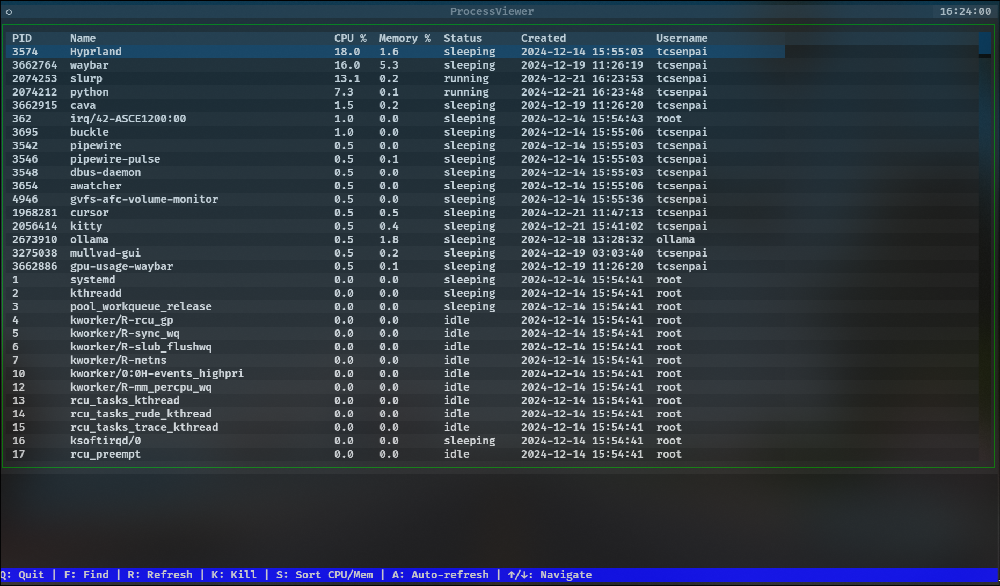

# psTUI - A terminal UI for managing processes



## Features

- Search processes by name
- Sort processes by CPU or memory usage
- Kill processes
- Toggle auto-refresh
- Lightweight and fast

## Install with pip

```bash
pip install pstui
```

### Run

```bash
pstui
```

## Run from source

### Installation

```bash
pip install -r requirements.txt
```

### Usage

```bash
python src/pstui/main.py
```

## Controls

- Q: Quit
- F: Find process
- R: Refresh
- K: Kill selected process
- S: Toggle sort (CPU/Memory)
- A: Toggle auto-refresh
- ↑/↓: Navigate

## License

Licensed under the [MIT License](LICENSE.md).
See [LICENSE.md](LICENSE.md) for more information.
